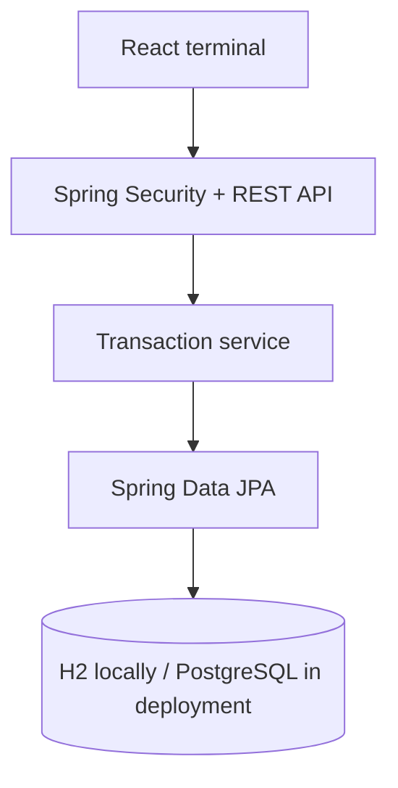

# Neon Ledger | District 01

Neon Ledger is a full-stack banking simulation built as a junior Java portfolio
project. It combines a Spring Boot transaction API with a cyberpunk-styled React
terminal and a deployable PostgreSQL setup.

> Educational software only. This project is not a production banking platform
> and does not process real customer data.

## Live demo

- **Application:** https://neon-ledger-ui.onrender.com
- **API health:** https://neon-ledger-api.onrender.com/actuator/health

Demo credentials:

```text
Username: demo
Password: NeonDemo-2026!
```

The free backend may take up to one minute to wake up after a period of inactivity.

## Why I built it

I wanted to practise more than basic CRUD operations, so I chose money
transfers, where validation, precision and transaction consistency matter. I am
also a fan of the Cyberpunk universe and previously worked in graphic design,
which inspired the visual direction of the interface.

The most useful lesson was that `@Transactional` alone is not enough: business
rules still have to reject invalid amounts and concurrent account updates need
an explicit strategy. The project therefore validates transfers and uses
optimistic locking.

## Architecture



```text
neon-ledger/
├── backend/             Spring Boot API
├── frontend/            React interface and Nginx image
├── .github/workflows/   CI pipeline
├── compose.yaml         Complete local deployment
└── README.md
```

## Highlights

- Atomic transfers with `@Transactional`
- Financial calculations with `BigDecimal`
- Validation of amount, decimal scale, accounts and self-transfers
- Optimistic locking with JPA `@Version`
- Consistent API errors with `@RestControllerAdvice`
- HTTP Basic Authentication with BCrypt-encoded server credentials
- OpenAPI / Swagger UI and Spring Boot health endpoint
- Unit, integration, security and frontend tests
- Multi-stage backend and frontend Docker images
- PostgreSQL production profile
- GitHub Actions checks for Java, React and Docker Compose

## Technology

- Java 21, Spring Boot 3.4, Spring Data JPA and Spring Security
- H2 for quick local development
- PostgreSQL for container and cloud deployment
- React 19, Axios and Nginx
- Maven, Docker Compose and GitHub Actions

## Quick start with Docker

Requirements: Docker Desktop with Docker Compose.

```bash
cp .env.example .env
docker compose up --build
```

PowerShell:

```powershell
Copy-Item .env.example .env
docker compose up --build
```

Before deploying publicly, replace both passwords in `.env`.

Once the services are healthy:

- Frontend: `http://localhost:3000`
- API: `http://localhost:8080`
- Swagger UI: `http://localhost:8080/swagger-ui/index.html`
- Health check: `http://localhost:8080/actuator/health`

The default demo username is `admin`. Its password comes from `.env`.

Stop the stack with:

```bash
docker compose down
```

Use `docker compose down -v` only when you also want to delete the local
PostgreSQL data.

## Local development without Docker

### Backend

```bash
cd backend
./mvnw spring-boot:run
```

The default local credentials are `admin` / `change-me-locally`. Override them
with `APP_SECURITY_USERNAME` and `APP_SECURITY_PASSWORD`.

### Frontend

```bash
cd frontend
cp .env.example .env.local
npm ci
npm start
```

Open `http://localhost:3000` and enter the backend credentials.

## API example

```bash
curl -u admin:change-me-locally \
  -H "Content-Type: application/json" \
  -d '{"from":"SK111222333","to":"SK999888777","amount":25.50}' \
  http://localhost:8080/api/transactions/transfer
```

The account identifiers are deliberately short demo values, not real customer
IBANs.

## Tests

```bash
cd backend
./mvnw verify

cd ../frontend
npm test -- --watchAll=false
npm run build
```

The suite covers successful transfers, insufficient funds, invalid values,
self-transfers, missing accounts, rollback and endpoint authentication.

## Cloud deployment

Both applications have their own `Dockerfile` and `railway.toml`.

For Railway, create three services from this repository:

1. PostgreSQL database.
2. Backend service with root directory `/backend`.
3. Frontend service with root directory `/frontend`.

Configure the backend variables:

```text
SPRING_PROFILES_ACTIVE=prod
SPRING_DATASOURCE_URL=jdbc:postgresql://<host>:<port>/<database>
SPRING_DATASOURCE_USERNAME=<database-user>
SPRING_DATASOURCE_PASSWORD=<database-password>
APP_SECURITY_USERNAME=<demo-user>
APP_SECURITY_PASSWORD=<strong-random-password>
APP_CORS_ALLOWED_ORIGIN=https://<frontend-domain>
```

Configure the frontend:

```text
API_BASE_URL=https://<backend-domain>
```

Do not commit real deployment passwords. The frontend receives the API URL at
container startup, so the same image can be used in different environments.

## Known limitations

- One in-memory demo user is shared by the interface.
- Basic Authentication must only be used over HTTPS outside localhost.
- Database schema updates use Hibernate in the demo production profile.
- Real banking software would require user-specific authorization, migrations,
  immutable auditing, encryption policies, observability and regulatory review.

## AI-assisted development

I used AI tools such as GitHub Copilot, ChatGPT and Claude for brainstorming,
troubleshooting and code review. I reviewed, adapted and tested the suggestions
and remain responsible for the final implementation.

## Author

Created by Marek Jankovič.
